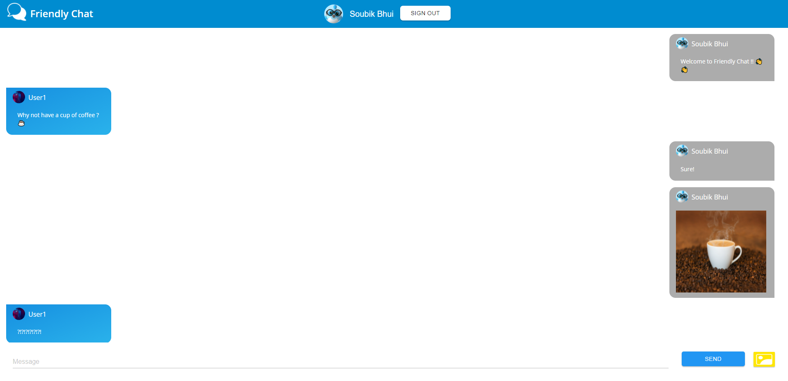

# Friendly Chat

My implementation of Friendly Chat App from **[Google CodeLabs](https://firebase.google.com/codelabs/firebase-web?hl=en&continue=https%3A%2F%2Fcodelabs.developers.google.com%2F#0)**.

Made with **[Firebase](firebase.google.com)**, **[MuiCSS](https://www.muicss.com/)**

### Checkout
[friendlychat-a5452.web.app](https://friendlychat-a5452.web.app/)

[friendlychat-a5452.firebaseapp.com](https://friendlychat-a5452.firebaseapp.com/)

## License
**[MIT](LICENSE)**
